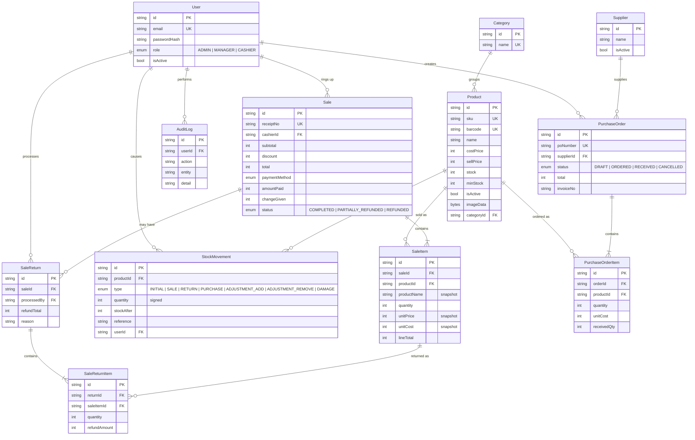

# Database

PostgreSQL, managed with Prisma. The source of truth is [`prisma/schema.prisma`](../prisma/schema.prisma) and the
migrations in [`prisma/migrations`](../prisma/migrations); the equivalent raw SQL is in [`schema.sql`](schema.sql).

**14 tables.** Money is stored as whole UGX in integer columns. Primary keys are `cuid` strings.

## Entity-relationship diagram

(Also available as an image: [er-diagram.png](er-diagram.png).)



Two helper tables sit outside the diagram: **`ShopSettings`** (one row, `id = 'main'`: shop name, address, phone, receipt
footer, cashier discount limit) and **`ReceiptCounter`** (one row per Kampala day, used to allocate receipt numbers atomically).

## Tables

| Table | Purpose | Notable rules |
|---|---|---|
| `User` | Staff accounts | Unique email; bcrypt `passwordHash`; `isActive` lets an account be disabled without deleting its history |
| `Category` | Product groups | Unique name; deleting a category leaves its products uncategorised |
| `Product` | Items for sale | Unique `sku` and `barcode`; `isActive` for soft removal; image stored as `bytea` |
| `StockMovement` | **Stock ledger** — one row per stock change | Signed `quantity`, `stockAfter` balance, `reference` (receipt / PO number); indexed by `(productId, createdAt)` |
| `Sale` | One completed transaction | Unique `receiptNo`; `status` moves to partially/fully refunded; indexed by date, cashier and payment method |
| `SaleItem` | Lines of a sale | **Snapshots** name, SKU, unit price and unit cost so history never changes when a product is edited |
| `SaleReturn` / `SaleReturnItem` | Refunds against a sale | A sale can have several returns; refunds sum to at most the amount paid |
| `Supplier` | Who stock is bought from | Soft-deactivated, never deleted |
| `PurchaseOrder` / `PurchaseOrderItem` | Orders to suppliers | `receivedQty` tracks partial deliveries; `invoiceNo` records the supplier's invoice |
| `AuditLog` | Who did what, and when | Includes sign-ins and failed sign-ins; also backs the login lockout; indexed by `(action, createdAt)` |
| `ShopSettings` | Shop-wide settings | Single row |
| `ReceiptCounter` | Receipt number allocation | One row per day |

## Integrity decisions

- **Sales are never deleted or edited.** A mistake is corrected with a return/refund, which keeps the audit trail.
- **Products with history can't be deleted** (foreign keys from sale and order lines); they are deactivated instead.
- **Stock can't go negative:** enforced by a conditional `UPDATE … WHERE stock >= n` in the same transaction as the sale.
- **Money is integers**, and each sale stores the prices that applied at the time.
- **Indexes** target the real queries: sales by date/cashier/payment method, ledger by product and time, audit by action and time.

## Migrations

```bash
npx prisma migrate deploy      # apply all migrations to an empty or existing database
npm run db:seed                # demo data (WIPES existing data)
```

Migrations run automatically on every deploy (`scripts/predeploy.ts`).
